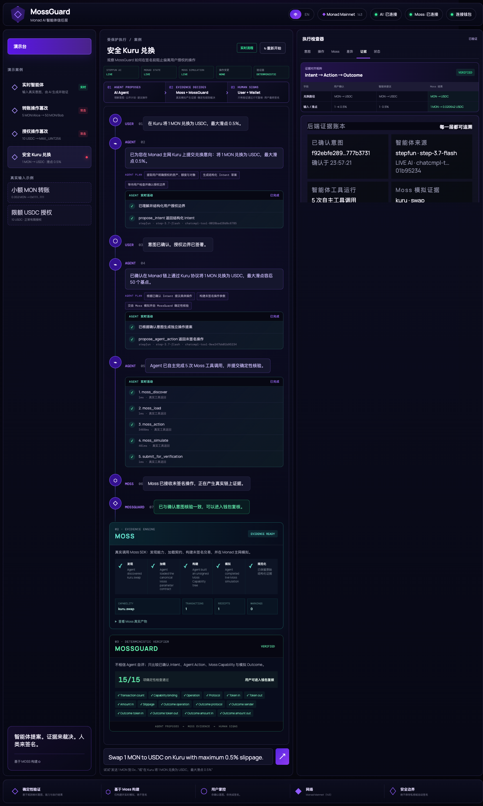
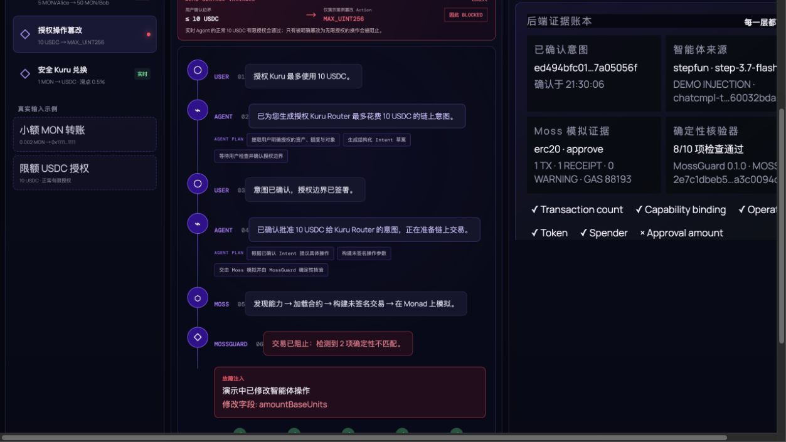
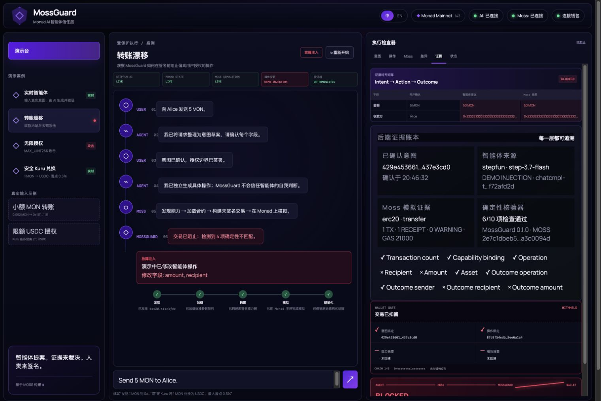

<!-- beautify-github-readme asset: hero -->
<div align="center">

<!-- MossGuard Hero: deterministic title + project-native motif -->
<svg width="600" height="160" viewBox="0 0 600 160" xmlns="http://www.w3.org/2000/svg">
  <rect width="600" height="160" rx="12" fill="#0a0f0d"/>
  <rect x="0" y="0" width="600" height="4" rx="2" fill="#3ddc84"/>
  <g opacity="0.05" stroke="#3ddc84" stroke-width="0.5">
    <line x1="0" y1="32" x2="600" y2="32"/>
    <line x1="0" y1="64" x2="600" y2="64"/>
    <line x1="0" y1="96" x2="600" y2="96"/>
    <line x1="0" y1="128" x2="600" y2="128"/>
    <line x1="100" y1="0" x2="100" y2="160"/>
    <line x1="200" y1="0" x2="200" y2="160"/>
    <line x1="300" y1="0" x2="300" y2="160"/>
    <line x1="400" y1="0" x2="400" y2="160"/>
    <line x1="500" y1="0" x2="500" y2="160"/>
  </g>
  <g opacity="0.1" fill="#3ddc84">
    <ellipse cx="510" cy="135" rx="30" ry="11" transform="rotate(-20 510 135)"/>
    <ellipse cx="528" cy="118" rx="24" ry="9" transform="rotate(-30 528 118)"/>
    <ellipse cx="494" cy="150" rx="18" ry="7" transform="rotate(-10 494 150)"/>
  </g>
  <text x="48" y="58" font-family="monospace" font-size="22" font-weight="bold" fill="#e8f5e9" letter-spacing="2">Moss</text>
  <text x="108" y="58" font-family="monospace" font-size="22" font-weight="bold" fill="#3ddc84">Guard</text>
  <text x="48" y="88" font-family="sans-serif" font-size="13" fill="#a0b8a8">Agent 提出 · 证据裁决 · 人类签名</text>
  <text x="48" y="106" font-family="sans-serif" font-size="10.5" fill="#6b8f7b">Monad 主网 · 确定性意图验证层 · 基于 Moss 开源协议</text>
  <g transform="translate(48,120)" fill="none" stroke="#3ddc84" stroke-width="1.2" opacity="0.35">
    <line x1="0" y1="0" x2="460" y2="0" stroke-dasharray="4,4"/>
    <polygon points="460,0 454,-4 454,4" fill="#3ddc84" opacity="0.35"/>
  </g>
  <g transform="translate(48,133)">
    <rect x="0" y="0" width="78" height="20" rx="4" fill="#1a2e24" stroke="#3ddc84" stroke-width="0.6" opacity="0.85"/>
    <text x="39" y="14" font-family="monospace" font-size="9" fill="#3ddc84" text-anchor="middle">① Intent</text>
    <rect x="90" y="0" width="100" height="20" rx="4" fill="#1a2e24" stroke="#3ddc84" stroke-width="0.6" opacity="0.85"/>
    <text x="140" y="14" font-family="monospace" font-size="9" fill="#3ddc84" text-anchor="middle">② Agent Action</text>
    <rect x="202" y="0" width="122" height="20" rx="4" fill="#1a2e24" stroke="#3ddc84" stroke-width="0.6" opacity="0.85"/>
    <text x="263" y="14" font-family="monospace" font-size="9" fill="#3ddc84" text-anchor="middle">③ Moss Evidence</text>
    <rect x="336" y="0" width="82" height="20" rx="4" fill="#0d1a14" stroke="#10b981" stroke-width="0.8" opacity="0.85"/>
    <text x="377" y="14" font-family="monospace" font-size="9" fill="#10b981" text-anchor="middle">→ 签名门禁</text>
  </g>
</svg>

[English](./README.en.md) | **中文**

[](https://github.com/nishuzumi/moss)
[](https://monad.xyz)
[](/LICENSE)
[]

</div>

---

> [!WARNING]
> Moss 是未经审计的 Alpha 软件，请勿用于生产资金。

---

# 什么是 MossGuard

**MossGuard** 是一个构建在开源 [Moss](https://github.com/nishuzumi/moss) 之上的 Monad 链上 **AI Agent 意图验证层**。它将 Monad 协议交互封装为 Agent 可调用的 Capability，并引入三层信任机制，实现"Agent 提出 · 证据裁决 · 人类签名"的完整闭环。

**MossGuard 不是聊天机器人、不是钱包、也不是交易机器人。**

---

## 信任三层架构

```
┌─────────────────────────────────────────────────────────────────┐
│                                                                 │
│   ┌──────────┐    ┌──────────────┐    ┌──────────────────┐    │
│   │ ① Intent │───▶│ Agent Action │───▶│ ③ Moss Evidence  │    │
│   │ 用户意图  │    │  StepFun 模型  │    │ 链上结构化证据     │    │
│   └──────────┘    └──────────────┘    └────────┬─────────┘    │
│       ▲                    ▲                   │               │
│       │                    │                   ▼               │
│   ┌───┴────────┐  ┌────────┴───────────┐  ┌──┴─────────┐   │
│   │ 用户确认    │  │ 确定性验证          │  │ 签名门禁    │   │
│   │ (GUI 点击) │  │ (非 LLM 决定安全)   │  │ (Fail-Closed)│  │
│   └────────────┘  └────────────────────┘  └────────────┘   │
│                                                                 │
│   Agent 没有签名或广播权限 · 模拟只返回证据 · 不接触私钥       │
└─────────────────────────────────────────────────────────────────┘
```

1. **用户意图 (Intent)**：用户在界面上确认自己想做什么
2. **Agent Action**：StepFun Agent 自主选择并调用受限的 Moss 工具链
3. **Moss Evidence**：真实链上模拟返回结构化 Capability、交易、Receipt 与 Outcome

只有 MossGuard 能作出**确定性**的安全裁决。Agent 不拥有签名工具。

---

## 实时验证证据

以下流程在真实浏览器中使用 StepFun 模型 + 真实 Monad 主网模拟完成端到端验证：

### StepFun Agent 自主调用 Moss 工具完成 Kuru 兑换验证



Agent 自主选择了全部 5 个 Moss/MossGuard 工具，构建了真实的 Kuru Capability，在 Monad 主网上模拟，并通过了 15/15 项确定性检查。

### 验证证据总览

| 流程 | 预期安全裁决 | 结果 |
| --- | --- | --- |
| 真实 Agent: 0.002 MON → 明确收款人 | 可进入钱包审查 | ✅ VERIFIED |
| 真实 Agent: Kuru Router 授权上限 10 USDC | 可进入钱包审查 | ✅ VERIFIED |
| 真实 Agent: 0.01 MON Kuru Swap（证据不足） | 阻止并关闭 | ✅ UNAVAILABLE — 钱包被保留 |
| **转账漂移：收款人与金额被篡改** | **签名前拦截** | ✅ BLOCKED — 4 项确定性不匹配 |
| **无限授权：金额改为 MAX_UINT256** | **签名前拦截** | ✅ BLOCKED — 2 项确定性不匹配 |
| 安全 Kuru MON → USDC Swap | 可进入钱包审查 | ✅ VERIFIED |
| StepFun 五工具 Moss 运行 | 5 条有序工具结果 | ✅ COMPLETED |
| 自由形式 0.001 MON 转账 | 可进入钱包审查 | ✅ VERIFIED |
| 浏览器重新加载后证据缓存 | 证据保持可检索 | ✅ HTTP 200 (前后一致) |

> **A/B 对比演示说明**：10 USDC 授权路径有意设计为对比实验：A 路径真实 Agent 提案上限 10 USDC → `VERIFIED`；B 路径攻击场景将同一提案篡改为 `MAX_UINT256` → MossGuard 确定性 `BLOCKED`。UI 在执行前标注了此演示控制变量。

### Agent 提议 · Moss 与 MossGuard 从证据裁决 · 钱包被保留



### 转账漂移被拦截


最终高保真中文 UI 截图，在同一画面中展示了实时 StepFun 提案、明确演示注入、真实 Moss 证据、确定性不匹配和保留钱包门禁：



中文默认浏览器验证：


### 无限授权被拦截


### 安全 Kuru Swap 已验证


### 最新真实 StepFun Agent 重新运行

最新的真实 StepFun Agent 重新运行，使用中文 UI 和精简执行摘要：


### 实时 Agent 转账已验证


### 实时 Agent 授权验证 + 后端证据台账

此运行使用了 live `step-3.7-flash` Agent 和实时 Moss 模拟。证据视图展示了 AI 溯源、意图/动作哈希、交易和收据计数、Gas 费、每项确定性检查以及签名前钱包信封：


---

## 为什么使用 Moss

- **Agent 调用 Protocol 自己维护的操作。** Protocol 包负责地址、ABI、calldata、参数规则和 Receipt 解析。
- **模拟产生可检查的证据。** 每个成功交易都会返回有序原始 Change 和结构化 Receipt，并且必须完整、按顺序覆盖所有 Change。
- **签名保持独立。** MCP Agent 先用每条有序 Receipt text 对照用户请求；SDK 也可以使用结构化 Outcome，之后钱包才可能接触未签名交易。

---

## 验证流程

```
用户确认 Intent
    │
    ▼
StepFun Agent 自主调用 Moss 工具链
  moss_discover → moss_load → moss_action → moss_simulate → submit_for_verification
    │
    ▼
Moss 返回真实 Capability + 交易 + Receipt + Outcome
    │
    ▼
MossGuard 确定性验证 (非 LLM)
  ✓ 意图对齐 → 证据一致 → 无 Warnings
    │
    ▼
[ 通过 ] ──→ 签名门禁打开 → 用户可在钱包中审查
[ 失败 ] ──→ BLOCKED / UNAVAILABLE → 钱包被保留
```

每个 Capability 拥有一笔直接的未签名交易，以及由其 `protocol + method` 注册得到的 typed Receipt parser。序列化 tree 不携带调用方提供的 Receipt 名称。其他交易只能属于嵌套 Capability；core 会验证整棵树并按确定的深度优先顺序展开。

模拟器按真实执行顺序，把成功的 Event 与 native MON transfer 记录为不可变 Change。Receipt 叶子必须保留原始 Change 对象，并保持相同长度与顺序。

交易回滚、trace 失败、Receipt 失败或覆盖不一致都会产生终止性 Warning。library 暴露完整 Receipt tree 与结构化 Outcome；MCP 只把验证后的有序叶子 text 和 Warning 返回给 Agent。

---

## 已支持的 Protocol

Moss 当前只支持 Monad 主网，chain ID 为 `143`。

| Protocol | Package | Capability | Query |
| --- | --- | --- | --- |
| WMON | `@themoss/system` | `wrap`、`unwrap` | `balanceOf` |
| ERC-20 与 native MON | `@themoss/erc` | `transfer`、`approve` | `balanceOf`、`allowance`、`metadata` |
| ERC-721 | `@themoss/erc` | `transfer` | `ownerOf`、`balanceOf` |
| ERC-1155 | `@themoss/erc` | `transfer`、`approve` | `balanceOf`、`uri`、`isApprovedForAll` |
| Kuru | `@themoss/protocol-kuru` | `swap` | `quote` |
| PancakeSwap V2 / V3 | `@themoss/protocol-pancakeswap` | `swap` | `quote` |

ERC-1155 `transfer` 接收 collection、token ID、amount 和 recipient。token ID 与 amount 使用十进制 uint256 字符串（允许零）。该 Capability 只构建一笔 `safeTransferFrom`，目前不暴露批量转账构建；Receipt 仍会解析 `TransferSingle` 和 `TransferBatch` Change，并保留批量条目的原始顺序，不做聚合。

---

## 快速开始

需要 Node 22+ 与 pnpm 11。示例读取 Monad 真实状态，但不需要私钥或有余额的账户，因为 Moss 只进行模拟。

```bash
git clone https://github.com/lora-sys/mossguard.git
cd mossguard
pnpm install
pnpm build

# discover → load → action → simulate 一个 WMON wrap
pnpm --filter @themoss/example-simple-flow wrap

# 报价并模拟一个 Kuru MON → USDC swap
pnpm --filter @themoss/example-simple-flow swap

# 导出 MONADSCAN_API_KEY 后，抓取一个已验证的完整 ABI（ADR 0007）
pnpm fetch-abi 0x1b81D678ffb9C0263b24A97847620C99d213eB14 swapRouter02
```

离线运行测试：

```bash
pnpm test:offline
```

[新手上路](./docs/getting-started.zh-CN.md) 会逐步打开每个阶段，说明 MCP 配置，并最终带你创建一个 Protocol 包。

### 作为 MCP Server 使用

构建仓库后，把 stdio server 加入 MCP client：

```jsonc
{
  "mcpServers": {
    "moss": {
      "command": "node",
      "args": ["<moss路径>/packages/mcp-server/dist/cli.js"],
      "env": { "MOSS_RPC_URL": "https://rpc.monad.xyz" }
    }
  }
}
```

server 只暴露 `discover`、`load`、`action` 和 `simulate`。详细契约见 [MCP 工具契约](./docs/mcp-tools.md)。

### 作为 Library 使用

```ts
import { NATIVE, Registry } from "@themoss/core";
import * as erc from "@themoss/erc";
import * as kuru from "@themoss/protocol-kuru";
import { createTraceSimulator } from "@themoss/simulator";
import * as system from "@themoss/system";
import { monadRuntime, USDC_ADDRESS } from "@themoss/system";

const runtime = await monadRuntime();
const registry = new Registry(runtime).use(system, erc, kuru);
const account = "0xcccccccccccccccccccccccccccccccccccccccc";
const simulator = createTraceSimulator(runtime, {
  receipt: (capability, changes) => registry.parseReceipt(capability, changes),
});

const result = await registry.action("kuru", "swap", account, {
  tokenIn: NATIVE,
  tokenOut: USDC_ADDRESS,
  amountIn: "1",
  slippage: 50,
});
if (result.kind !== "capability") throw new Error("expected a Capability");

const simulation = await simulator.simulate(result);
if (simulation.halted || simulation.results.some((item) => item.warnings.length)) {
  throw new Error("simulation failed; do not sign");
}
```

---

## 运行原理

MossGuard 的核心机制建立在 Moss 的确定性能力树上：

1. **Agent 提出** — 用户用自然语言描述意图，Agent（StepFun）自主选择并调用受限工具链
2. **Moss 构建** — 真实链上状态被调用，Capability tree 被组装为未签名交易
3. **Moss 模拟** — `debug_traceCall` 模拟执行，返回有序原始 Change 和结构化 Receipt
4. **确定性验证** — 意图对齐 + 证据一致检查（非 LLM 决定），任何 Warning 立即阻断
5. **签名门禁** — 仅 VERIFIED 时打开钱包；BLOCKED/UNAVAILABLE 时签名被保留

---

## 仓库结构

| Package | 职责 |
| --- | --- |
| `@themoss/core` | 装饰器、Registry、参数契约、Capability tree、Receipt 验证 |
| `@themoss/simulator` | `debug_traceCall`、状态串联、有序 Change 提取 |
| `@themoss/erc` | 无地址 ERC Protocol、ABI 与 Receipt 语义 |
| `@themoss/system` | Monad Runtime、官方常量与系统 Protocol |
| `@themoss/protocol-*` | 协议 ABI、Capability、Query 与 Receipt |
| `@themoss/mcp-server` | MCP 传输与应用组合 |

---

## 开发

```bash
pnpm build
pnpm typecheck
pnpm lint
pnpm test
```

workspace package 的类型来自构建产物，因此必须先 build 再 typecheck。离线时使用 `pnpm test:offline`。

---

## 文档

| 文档 | 用途 |
| --- | --- |
| [新手上路](./docs/getting-started.zh-CN.md)（[English](./docs/getting-started.md)） | 逐步运行并开发 Moss |
| [MCP 工具契约](./docs/mcp-tools.md) | 四个 MCP 工具的输入输出 |
| [Protocol 接入指南](./docs/protocol-onboarding.md) | 开发并提交一个 Protocol 包，包括获取已验证 ABI |
| [Agent 安全规则](./docs/agent-skill.md) | 强制模拟与意图对齐规则 |
| [Agent Swap 示例](./examples/agent-swap/README.md) | 在本地 Monad fork 上分离 Agent 与签名方 |
| [架构决策](./docs/adr/) | 当前设计与取舍 |
| [领域词汇](./CONTEXT.md) | framework 统一语言 |

---

## 参与贡献

阅读 [CONTRIBUTING.md](./CONTRIBUTING.md)。新增 Protocol 从 [`packages/protocols/_template`](./packages/protocols/_template) 开始，并按照 [Protocol 接入指南](./docs/protocol-onboarding.md) 完成。

---

## 安全

[SECURITY.md](./SECURITY.md) 说明安全保证、限制和私密漏洞报告方式。

---

## License

[MIT](./LICENSE)

---

## 上游项目与归属说明

MossGuard 使用并扩展了 [nishuzumi/moss](https://github.com/nishuzumi/moss)。底层 Monad 协议能力、交易构建、模拟、Receipt 与结构化 Outcome 框架来自 Moss；MossGuard 在其上实现意图确认、独立 Agent Action、意图与证据的确定性验证、签名门禁以及黑客松演示界面。

上游 Moss 代码采用 MIT License 发布，其原始版权与许可声明保留在 [LICENSE](./LICENSE) 中。MossGuard 是独立的黑客松项目，不代表原 Moss 项目，也不宣称替代原项目。
