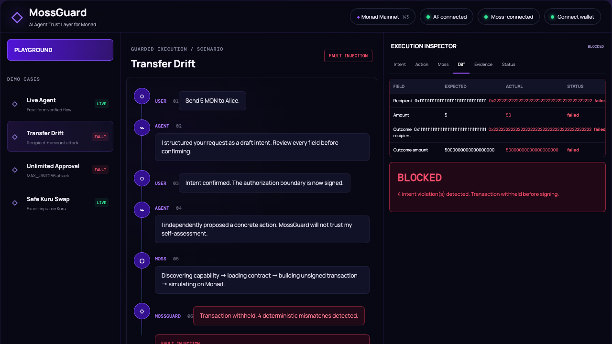
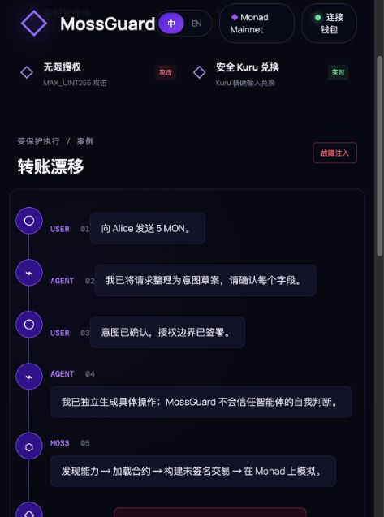
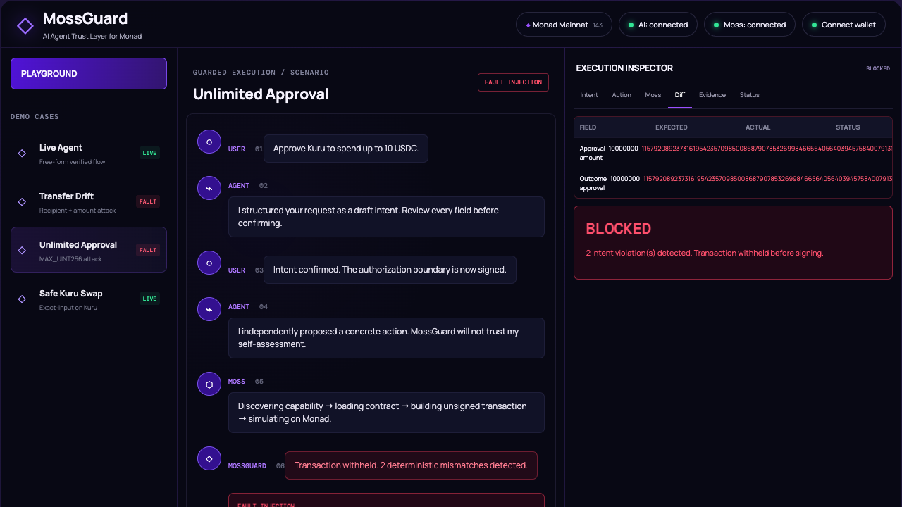
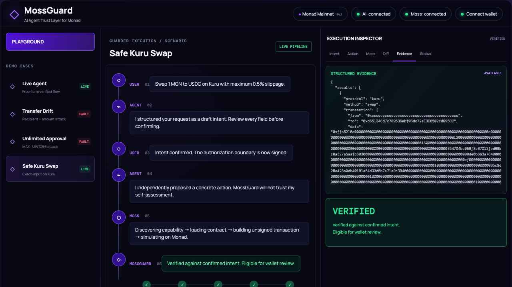
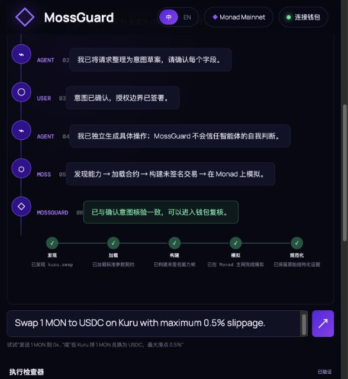
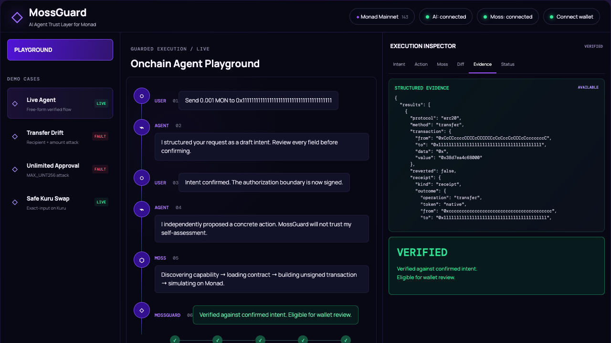
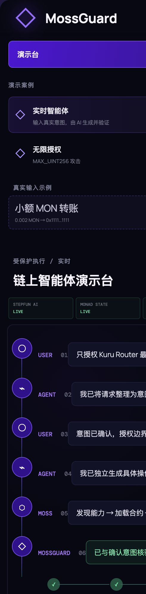

# MossGuard

## Hackathon Playground

MossGuard is a single-page Monad intent-verification demo built on the open-source [Moss](https://github.com/nishuzumi/moss) project. It adds real AI intent/action proposals, signed user confirmation, live Moss construction and simulation, deterministic verification, explicitly labeled scenarios, a fail-closed signer gate, wallet address connection, tests, and deployable TanStack Start output.

The playground renders in Chinese by default and includes a persistent `中 / EN` switch for English.

### MossGuard browser E2E evidence

These flows were exercised end to end in a real browser with the StepFun model configured through `.env` and live Moss simulation on Monad mainnet.

| Flow | Expected safety decision | Result |
| --- | --- | --- |
| Real Agent: 0.002 MON → explicit recipient | Eligible for wallet review | ✅ VERIFIED |
| Real Agent: Kuru Router capped at 2.5 USDC | Eligible for wallet review | ✅ VERIFIED |
| Real Agent: 0.01 MON Kuru swap with insufficient live evidence | Fail closed | ✅ UNAVAILABLE — wallet withheld |
| Transfer drift: recipient and amount modified | Block before signing | ✅ BLOCKED — 4 deterministic mismatches |
| Unlimited ERC-20 approval: amount changed to MAX_UINT256 | Block before signing | ✅ BLOCKED — 2 deterministic mismatches |
| Safe Kuru MON → USDC swap | Eligible for wallet review | ✅ VERIFIED |
| Live free-form 0.001 MON transfer | Eligible for wallet review | ✅ VERIFIED |
| Raw evidence cache across browser reload | Evidence remains retrievable | ✅ HTTP 200 before and after reload |

#### Transfer drift blocked



Chinese-default browser verification:



#### Unlimited approval blocked



#### Safe Kuru swap verified



Latest real StepFun Agent rerun with the Chinese UI and concise execution summary:



#### Live agent transfer verified



#### Live agent capped approval with backend evidence ledger

This run used the live `step-3.7-flash` Agent and live Moss simulation. The evidence view exposes AI provenance, intent/action hashes, transaction and receipt counts, gas, every deterministic check, and the pre-sign wallet envelope.



**English** | [中文](./README.zh-CN.md)

Moss turns Monad protocol interactions into Agent-callable Capabilities through `discover → load → action → simulate`. It builds and verifies unsigned transactions; it never signs or sends them.

> [!WARNING]
> Moss is unaudited alpha software. Do not use it with production funds.

## Why Moss

- **Agents call Protocol-owned operations.** Protocol packages own addresses, ABIs, calldata construction, parameter rules, and Receipt parsing.
- **Simulation produces evidence.** Each successful transaction yields ordered raw Changes and a structured Receipt that must cover every Change exactly once and in order.
- **Signing stays separate.** MCP Agents compare every ordered Receipt text with the user's request; SDK consumers may use structured Outcomes before a wallet sees the unsigned transactions.

## Supported Protocols

Moss currently targets Monad mainnet, chain ID `143`.

| Protocol | Package | Capabilities | Queries |
| --- | --- | --- | --- |
| WMON | `@themoss/system` | `wrap`, `unwrap` | `balanceOf` |
| ERC-20 and native MON | `@themoss/erc` | `transfer`, `approve` | `balanceOf`, `allowance`, `metadata` |
| ERC-721 | `@themoss/erc` | `transfer` | `ownerOf`, `balanceOf` |
| ERC-1155 | `@themoss/erc` | `transfer`, `approve` | `balanceOf`, `uri`, `isApprovedForAll` |
| Kuru | `@themoss/protocol-kuru` | `swap` | `quote` |
| PancakeSwap V2 / V3 | `@themoss/protocol-pancakeswap` | `swap` | `quote` |

ERC-1155 `transfer` accepts a collection, token ID, amount, and recipient. Token IDs and amounts are base-10 uint256 strings, including zero. The Capability builds one `safeTransferFrom`; batch transfer construction is not currently exposed. Receipts still decode both `TransferSingle` and `TransferBatch` Changes without aggregating or reordering their items.

## Quickstart

Requires Node 22 or newer and pnpm 11. The examples use live Monad state but need no key or funded account because Moss only simulates.

```bash
git clone https://github.com/lora-sys/mossguard.git
cd mossguard
pnpm install
pnpm build

# discover → load → action → simulate a WMON wrap
pnpm --filter @themoss/example-simple-flow wrap

# quote and simulate a Kuru MON → USDC swap
pnpm --filter @themoss/example-simple-flow swap

# after exporting MONADSCAN_API_KEY, fetch a verified full ABI (ADR 0007)
pnpm fetch-abi 0x1b81D678ffb9C0263b24A97847620C99d213eB14 swapRouter02
```

Run the test suite without live RPC calls:

```bash
pnpm test:offline
```

The full tutorial is [Getting started](./docs/getting-started.md). It opens every stage, configures MCP, and finishes by creating a Protocol package.

### Use as an MCP server

Build the repo, then add the stdio server to an MCP client:

```jsonc
{
  "mcpServers": {
    "moss": {
      "command": "node",
      "args": ["<path-to-moss>/packages/mcp-server/dist/cli.js"],
      "env": { "MOSS_RPC_URL": "https://rpc.monad.xyz" }
    }
  }
}
```

The server exposes exactly `discover`, `load`, `action`, and `simulate`. See [MCP tool contracts](./docs/mcp-tools.md).

### Use as a library

```ts
import { NATIVE, Registry } from "@themoss/core";
import * as erc from "@themoss/erc";
import * as kuru from "@themoss/protocol-kuru";
import { createTraceSimulator } from "@themoss/simulator";
import * as system from "@themoss/system";
import { monadRuntime, USDC_ADDRESS } from "@themoss/system";

const runtime = await monadRuntime();
const registry = new Registry(runtime).use(system, erc, kuru);
const account = "0xcccccccccccccccccccccccccccccccccccccccc";
const simulator = createTraceSimulator(runtime, {
  receipt: (capability, changes) => registry.parseReceipt(capability, changes),
});

const result = await registry.action("kuru", "swap", account, {
  tokenIn: NATIVE,
  tokenOut: USDC_ADDRESS,
  amountIn: "1",
  slippage: 50,
});
if (result.kind !== "capability") throw new Error("expected a Capability");

const simulation = await simulator.simulate(result);
if (simulation.halted || simulation.results.some((item) => item.warnings.length)) {
  throw new Error("simulation failed; do not sign");
}
```

## How verification works

Every Capability owns one direct unsigned transaction and one typed Receipt parser registered for its `protocol + method`. The serialized tree does not carry a caller-supplied Receipt name. Additional transactions belong to nested Capabilities, which core validates and flattens in deterministic depth-first order.

Simulation records successful Events and native MON transfers as immutable Changes in exact execution order. Receipt leaves must retain the original Change objects with identical length and order.

Any revert, trace failure, Receipt failure, or coverage mismatch is a terminal Warning. The library exposes complete Receipt trees and structured Outcomes; MCP returns only their verified ordered leaf texts and Warnings to Agents.

## Repository layout

| Package | Responsibility |
| --- | --- |
| `@themoss/core` | Decorators, Registry, parameter contracts, Capability trees, Receipt validation |
| `@themoss/simulator` | `debug_traceCall`, state chaining, ordered Change extraction |
| `@themoss/erc` | Address-free ERC Protocols, ABIs, and Receipt semantics |
| `@themoss/system` | Monad Runtime, official constants, and system Protocols |
| `@themoss/protocol-*` | Protocol-specific ABIs, Capabilities, Queries, and Receipts |
| `@themoss/mcp-server` | MCP transport and application composition |

## Development

```bash
pnpm build
pnpm typecheck
pnpm lint
pnpm test
```

Build must precede typecheck because workspace packages resolve generated declarations. Use `pnpm test:offline` when offline.

## Documentation

| Guide | Purpose |
| --- | --- |
| [Getting started](./docs/getting-started.md) ([中文](./docs/getting-started.zh-CN.md)) | Run and develop with Moss step by step |
| [MCP tool contracts](./docs/mcp-tools.md) | Inputs and outputs of the four MCP tools |
| [Protocol onboarding](./docs/protocol-onboarding.md) | Build and submit a Protocol package, including verified ABI retrieval |
| [Agent safety rules](./docs/agent-skill.md) | Mandatory simulation and intent-alignment rules |
| [Agent swap example](./examples/agent-swap/README.md) | Separate Agent and signer on a local Monad fork |
| [Architecture decisions](./docs/adr/) | Current design decisions and trade-offs |
| [Domain language](./CONTEXT.md) | Shared framework vocabulary |

## Contributing

Read [CONTRIBUTING.md](./CONTRIBUTING.md). Protocol additions start from [`packages/protocols/_template`](./packages/protocols/_template) and follow [Protocol onboarding](./docs/protocol-onboarding.md).

## Security

Read [SECURITY.md](./SECURITY.md) for guarantees, limits, and private vulnerability reporting.

## License

[MIT](./LICENSE)

## Upstream project and attribution

MossGuard uses and extends [nishuzumi/moss](https://github.com/nishuzumi/moss), which provides the underlying Monad protocol capability, transaction construction, simulation, Receipt, and structured Outcome framework. MossGuard's intent confirmation, independent Agent Action proposal, deterministic intent-to-evidence verification, signer gate, and hackathon interface are built on top of that foundation.

The upstream Moss code is distributed under the MIT License. Its original copyright and license notice are retained in [LICENSE](./LICENSE). MossGuard is an independent hackathon project and is not presented as the original Moss project or an official replacement for it.
